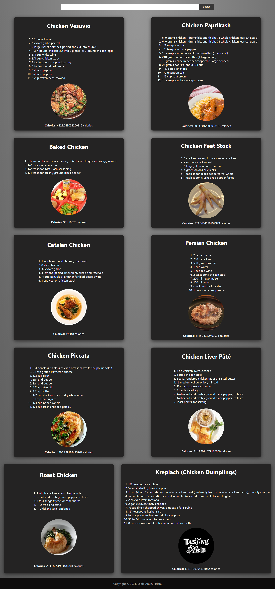

# Simple Food Recipes site in `React`

a simple recipe site where all data fetches through **API**. This whole project is done with **React framework**. where also **search** option included. For the basic design **CSS** used.

Snapshots:

search beef recipe

